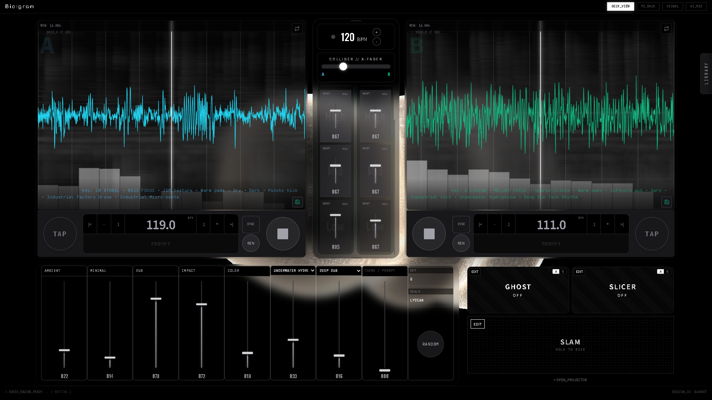

# Bio:gram (Ghost in the Groove)

> "Noise is where the universe resides."

**Bio:gram** is an experimental AI-driven DJ system, a "Prompt-DJ" platform powered by **Google's Gemini 1.5 Flash**. It transcends traditional linear mixing by employing a **Deep Spectral Architect**, allowing the AI to act as a "Ghost" partner that performs spectral handoffs, organic parameter manipulation, and narrative-driven transitions.

[🇯🇵 日本語 (Japanese)](README_JP.md)


*Figure 1: Main Interface featuring the AI Director Panel and Dual Decks.*

## � Core Philosophy

### 1. Organic "Gardening" vs. Mechanical Mixing
Bio:gram treats a DJ mix not as a sequence of triggered events, but as a **living garden**. The AI doesn't just "crossfade"; it cultivates the soundscape. It introduces "wobble" (hesitation) and "drift" into parameter curves to mimic human imperfection (**Wabi-Sabi**), creating a mix that breathes rather than computes.

### 2. Deep Spectral Architecture
Unlike standard auto-mixers that simply lower volume, Bio:gram employs a **Spectral Handoff** strategy. It analyzes and carves out frequency bands (Bass, Mids, Highs) to ensure that two kick drums never clash, while allowing high-frequency textures to weave together seamlessly.

---

## ✨ Features

### 🎛️ AI Mix Phase Architecture
The AI orchestrates mixes through four distinct narrative phases, visualized on the interface:
1.  **Presence (The Omen)**: The incoming track manifests only as a "ghost"—reverb tails and high-pass filtered textures—before it is truly heard.
2.  **Spectral Handoff ( The Exchange)**: The core mechanic. Low frequencies are swapped with surgical precision using sigmoid curves, while the energy shifts organically.
3.  **Wash Out (The Echo)**: The outgoing track is not just silenced but actively "eroded" using tape delays and feedback loops, dissolving into memory.
4.  **Silent Reset (The Purification)**: A hidden cleanup phase where the AI resets all parameters to prepare the deck for its next reincarnation.

### 👻 Ghost Faders
Watch as the sliders and knobs on the UI move by themselves. This is not a pre-recorded animation but real-time control by the **Gemini 1.5 Flash** model, executing the "Automation Score" it generated on the fly.

### 🧠 Generative Modes
Control the narrative with distinct AI personalities:
-   **Deep Blend**: Long, fluid transitions (64-128 bars) for Ambient and Deep Techno.
-   **Rhythmic Swap**: Sharp, percussive cuts using gates and slicers for House and Hard Techno.
-   **Chaos Gen**: Experimental feedback loops and bit-crushing for when the mix needs to be destroyed to be reborn.
-   **Cinema**: Eternal freezes and drone layers for soundtrack-like soundscapes.

### 🧬 Visual Matrix (Hydra)
Built-in **Hydra-Synth** integration reacts to audio bands in real-time, generating code-driven visuals that mirror the spectral changes of the mix.

---

## 🛠️ Tech Stack

-   **Framework**: Vite + TypeScript
-   **AI Model**: Google Gemini 1.5 Flash (via `@google/genai`)
-   **Audio Engine**: Web Audio API + AudioWorklet (Sample-accurate timing)
-   **UI**: Lit (Web Components) + TailwindCSS
-   **Visuals**: Hydra-Synth + p5.js
-   **Data Consistency**: "Local-First" architecture using IndexedDB

---

## 🚀 Setup

### 1. Prerequisites
-   Node.js (v18+)
-   Google AI Studio API Key (Gemini)

### 2. Installation
```bash
git clone https://github.com/youshinh/biogram.git
cd biogram
npm install
```

### 3. Environment Variables
Create a `.env` file in the root directory:
```env
GEMINI_API_KEY=your_api_key_here
```

### 4. Start
```bash
npm run dev
```
Open `http://localhost:3000` to enter the garden.

## 🎮 Usage

1.  **Load & Play**: Press "PLAY" on Deck A/B.
2.  **Direct**: Open the central "SUPER CONTROLS" panel.
3.  **Prompt**: Select a mode (e.g., "Deep Blend") and Duration (e.g., "64 Bars").
4.  **Influence**: Use the "Mood" sliders (Ambient, Acid, etc.) to bias the AI's parameter generation.
5.  **Inject**: Press the **[ Deep Mix -> ]** button and watch the Ghost Faders take over.

---

## 🤝 Contributing
Issues and Pull Requests are welcome. Please read [CONTRIBUTING.md](CONTRIBUTING.md) before submitting.

## 📄 License
[MIT License](LICENSE)
