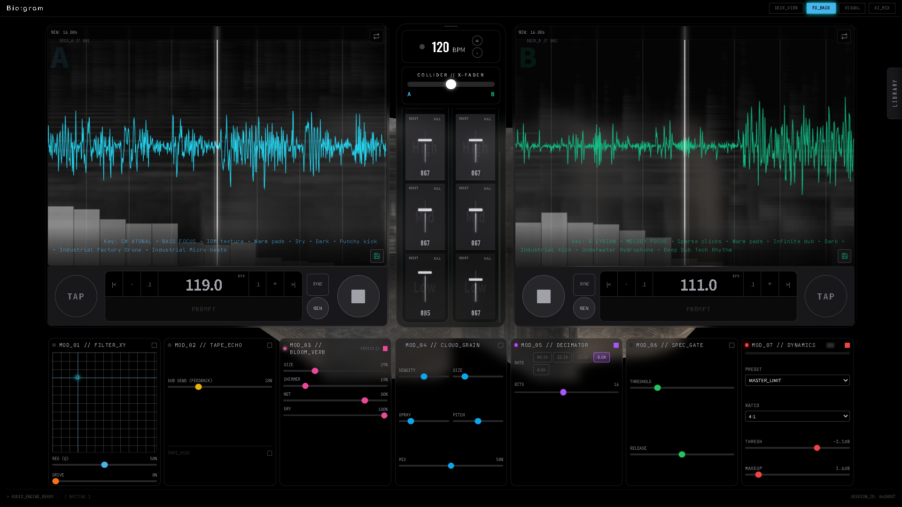
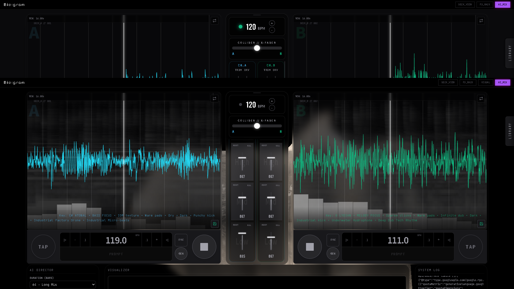
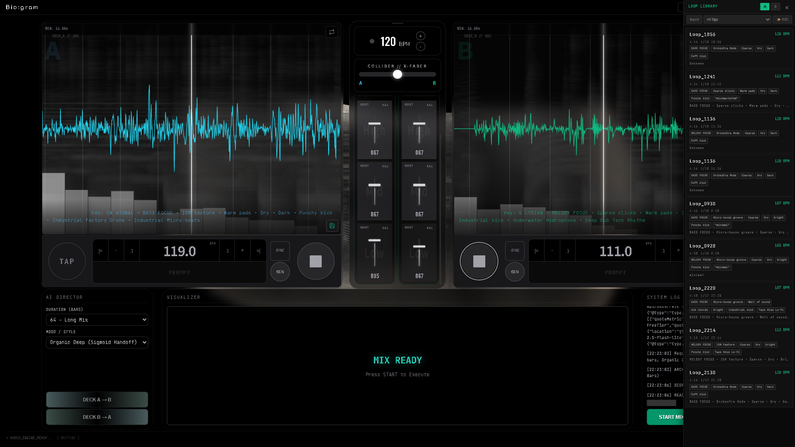

# Bio:gram (Ghost in the Groove)

**Bio:gram** is an experimental generative AI DJ system powered by Google's Gemini API.
It generates musical instructions from text prompts, performing real-time mixing, effect manipulation, and visual generation using Hydra.


*Main Interface*

### 🎛️ Screens

| FX Rack | AI Mix |
|:---:|:---:|
|  |  |


*Loop Library View*

## ✨ Features

- **AI Auto-Mix**: Uses the Gemini API to automatically generate and execute transitions that match the mood and BPM of the current track.
- **Dynamic Prompts**: Control the direction of the real-time generated music by manipulating parameter sliders such as "Ambient", "Minimal", "Dub", and "Acid".
- **Hydra Visualizer**: Built-in programmable visuals (Hydra) that react to the music.
- **MIDI Support**: Connect an external MIDI controller to physically manipulate parameters with faders and knobs.
- **Dual Deck System**: A full-fledged DJ mix style with a 2-deck configuration (Deck A / Deck B).

## 🛠️ Tech Stack

- **Framework**: Vite + TypeScript
- **UI**: Lit (Web Components), TailwindCSS
- **AI**: @google/genai (Gemini 1.5 Pro/Flash)
- **Audio**: Web Audio API
- **Visuals**: Hydra-Synth
- **Database**: IndexedDB (via idb) for Loop Library

## 🚀 Setup

### 1. Prerequisites

- Node.js (v18 or higher recommended)
- Google AI Studio API Key (Gemini)

### 2. Installation

```bash
git clone https://github.com/your-username/biogram.git
cd biogram
npm install
```

### 3. Environment Variables

Create a `.env` file in the root directory and set your API key.

```env
GEMINI_API_KEY=your_api_key_here
```

### 4. Start

```bash
npm run dev
```
Open `http://localhost:5173` in your browser.

## 🎮 Usage

1.  **Start**: Press the "PLAY" button on the screen or the play button on each deck to start the audio engine.
2.  **Prompting**: Move the upper sliders (Ambient, Minimal, etc.) to adjust the atmosphere of the generated phrases.
3.  **Generative Mix**: Press the "GEN" button to generate and load a new phrase based on the current settings.
4.  **AI Automation**: In the central "SUPER CONTROLS" section, you can issue commands for an automatic mix from Deck A → B.

## 🤝 Contributing

Pull requests are welcome. For major changes, please open an issue first to discuss what you would like to change.
Please see [CONTRIBUTING.md](CONTRIBUTING.md) for details.

## 📄 License

[MIT License](LICENSE)
