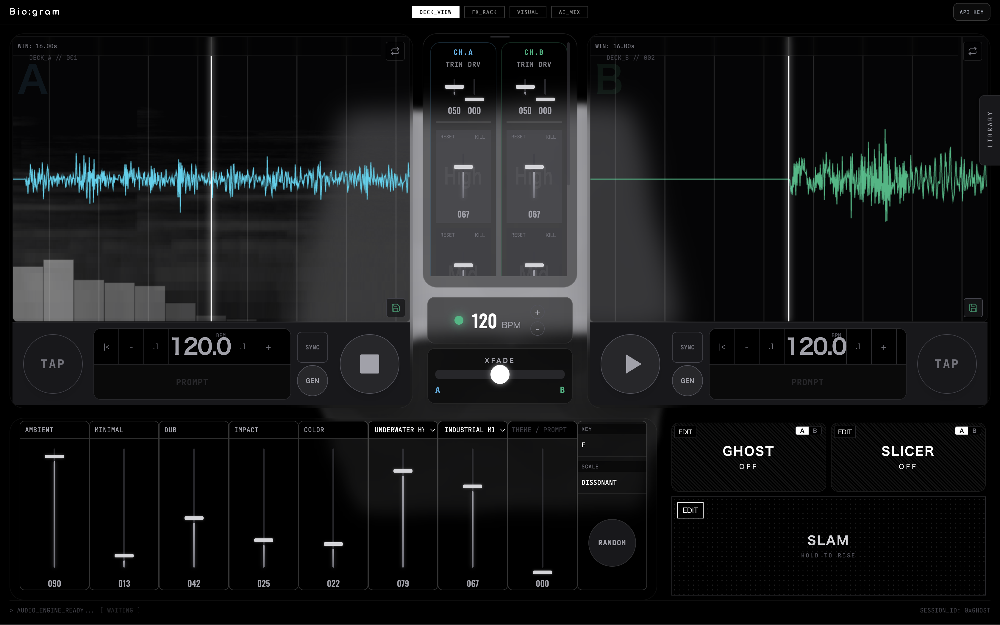
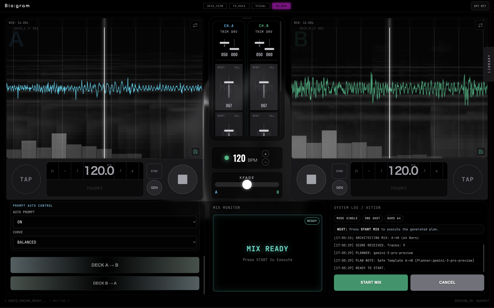
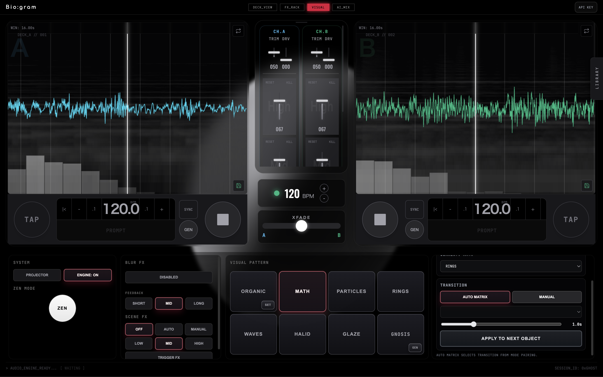

# Bio:gram

[🇯🇵 日本語版](README_JP.md)


## Current Product Summary

Bio:gram is a browser-based AI DJ system with:

- Dual-deck realtime music generation via Google Lyria (`lyria-realtime-exp`)
- AI-generated integrated mix plan (JSON) via Gemini 3 Pro (`gemini-3-pro-preview`) for mix planning only
- Lightweight AI tasks (grid/analysis/prompt helpers) via Gemini Flash Lite (`gemini-flash-lite-latest`)
- AudioWorklet-based DSP and deck mixing
- Live visuals (Three.js-based) that react to mixer/FX/analysis events
- Local loop library (IndexedDB) with save/load/import/export/recommend features

## What Is Implemented Now

### 1. Decks and Transport

- Two decks (`A` / `B`) with independent play/stop, sync toggle, BPM adjust, TAP BPM, prompt input, GEN trigger
- Deck waveform/visual area (`hydra-visualizer`) and deck-level generated prompt display
- Deck sync logic with BPM ratio + phase alignment in `AudioEngine`

Relevant code:

- `src/ui/modules/deck-controller.ts`
- `src/audio/engine.ts`



### 2. AI Prompt-to-Music Flow

- App starts with an initialization overlay (`INITIALIZE SYSTEM`)
- On init, AudioWorklet is loaded, Lyria sessions connect for both decks, and generation begins
- Deck GEN updates or resets prompt context (hard reset when deck is stopped)
- Prompt text is built from UI state (ambient/minimal/dub/impact/color, texture/pulse, key/scale, deck personality, slam state)

Relevant code:

- `src/main.ts`
- `src/ai/prompt-generator.ts`
- `src/ai/music-client.ts`

### 3. AI Mix (Director Panel)

- Super Controls can request mix generation for `A->B` or `B->A`
- Mix request includes direction, duration (16/32/64/128), mood, preferred visual mode
- Gemini 3 Pro returns an integrated mix plan, then `audio_plan` is executed as `AutomationScore`
- `AutomationEngine` executes score curves over bars with interpolation and safety guards
- UI states: `IDLE -> GENERATING -> READY -> MIXING`

Relevant code:

- `src/ui/modules/super-controls.ts`
- `src/ai/mix-generator.ts`
- `src/ai/automation-engine.ts`



### 4. DSP / Mixer / FX

- Audio path is handled by AudioWorklet processor
- Mixer controls include crossfader and deck EQ/kill/trim/drive mappings
- FX rack exposes multiple modules including filter, tape echo, bloom reverb, spectral gate, cloud grain, decimator, dynamics
- SLAM macro applies energy-riser style macro control (filter/res/drive/noise)

Relevant code:

- `src/audio/worklet/processor.ts`
- `src/audio/worklet/dsp/*`
- `src/ui/modules/dj-mixer.ts`
- `src/ui/modules/fx-rack.ts`
- `src/main.ts`

### 5. Visual System

- Main controller view includes background `three-viz`
- Visual controls support:
  - mode switching (`organic`, `wireframe`, `monochrome`, `rings`, `waves`, `suibokuga`, `grid`, `ai_grid`)
  - deck texture upload (image/video), webcam toggle
  - blur FX and rendering on/off
  - projector window via `/?mode=viz`
  - zen mode overlay controller
- AI grid parameter generation is available via Gemini
- Visual score sync now uses audio frame timing (`startFrame/endFrame`) produced by `MusicClient` to reduce drift

Relevant code:

- `src/ui/visuals/ThreeViz.ts`
- `src/ui/visuals/VisualControls.ts`
- `src/ai/grid-generator.ts`



### 6. Loop Library

- Save current deck audio as loop (8/16/32/64/128 bars)
- Audio validity check before saving
- IndexedDB storage with tags, vector metadata, BPM, prompt
- Import audio files, export WAV, delete loops
- Recommend loops from current deck vector similarity
- Sidebar open/close uses explicit visibility control (`setLibraryPanelVisible`) for stable toggle behavior

Relevant code:

- `src/ui/modules/loop-library-panel.ts`
- `src/audio/db/library-store.ts`
- `src/audio/utils/audio-analysis.ts`
- `src/ui/bootstrap/library-sidebar.ts`

### 7. Mobile UX (Current)

- Bottom fixed mobile tab bar for quick view switching (`DECK / FX / VISUAL / AI MIX`)
- Mobile deck mini controls optimized for touch targets (larger PLAY/GEN/BPM controls)
- GEN button includes short pulse feedback animation

## Runtime Architecture

- UI/Main Thread:
  - Lit components + orchestration in `main.ts`
  - AI API calls (mix generation, visual analysis/grid generation)
  - Bootstrap modules for event wiring and lifecycle cleanup:
    - `src/ui/bootstrap/deck-transport-events.ts`
    - `src/ui/bootstrap/visual-sync-events.ts`
    - `src/ui/bootstrap/library-sidebar.ts`
    - `src/ui/bootstrap/zen-overlay.ts`
- Audio Thread:
  - AudioWorklet processor reads/writes from SharedArrayBuffer
  - DSP modules process deck/master signal
- Data:
  - IndexedDB for loop/chunk archive (`promptdj-ghost-memory`)

## Setup

### Prerequisites

- Node.js 18+
- Google API key with access to Gemini and Lyria endpoints used in the code

### Install

```bash
npm install
```

### Environment Variables

Create `.env` in project root:

```env
GEMINI_API_KEY=your_api_key_here
```

Notes:

- `GEMINI_API_KEY` is used only on the local backend middleware (`/api/*`) and is not exposed to browser code.
- Realtime Lyria deck generation still uses the local API key entered in the app's API settings dialog (client-side), until a WS relay path is introduced.

### Start

```bash
npm run dev
```

Open: `http://localhost:3000`

## Basic Usage Flow

1. Click `INITIALIZE SYSTEM`.
2. Use deck controls to play decks and adjust BPM/prompt.
3. Press `GEN` on a deck to apply/update AI prompt.
4. Open `SUPER` view and request `A->B` or `B->A` mix.
5. When score is ready, press `START MIX`.
6. Optionally switch visual modes or open projector mode.
7. Save loops to library and reload/import/export as needed.

## WebMCP (AIMIX Agent Control)

Bio:gram now exposes AIMIX controls to in-browser agents via WebMCP (Imperative API).

### Exposed tools

- `aimix_generate`: request mix generation (single/free mode).
- `aimix_start`: start generated mix (`READY` required).
- `aimix_cancel`: cancel generated mix before start (`READY` required).
- `aimix_abort`: stop running mix (`MIXING/WAIT_NEXT/POST_REGEN` required).
- `aimix_get_state`: read current AIMIX/deck state snapshot.

### Agent-side setup (Chrome Early Preview)

1. Use Chrome `146.0.7672.0` or newer.
2. Open `chrome://flags/#enable-webmcp-testing` and set **WebMCP for testing** to `Enabled`.
3. Relaunch Chrome.
4. Start Bio:gram (`npm run dev`) and open the app tab.
5. (Recommended) Install and open **Model Context Tool Inspector** extension to:
   - confirm registered tools
   - run tools manually
   - test natural-language invocation via Gemini in the extension

### Recommended invocation flow

1. Ask user to click `INITIALIZE SYSTEM` first.
2. Call `aimix_generate` with desired parameters.
3. Poll `aimix_get_state` until `mixState === "READY"`.
4. Call `aimix_start`.
5. During playback, use `aimix_get_state` (and `aimix_abort` if needed).

### Important note (MCP vs WebMCP)

- This implementation is **WebMCP** (browser-native, tab context required), not a standalone MCP server endpoint.
- If you need remote/server-side MCP clients, add a separate MCP server layer that calls app/backend APIs.

## Evaluation / Verification Assets

There is no `npm test` script yet.
Current verification helpers:

- `scripts/eval-beat-detector.ts`
- `scripts/eval-beat-detector.js`
- `py_bridge/analyze.py`
- `py_bridge/test_analyze.py`

## Important Constraints

- This app relies on `SharedArrayBuffer`; COOP/COEP headers are configured for Vite dev server in `vite.config.ts`.
- Docker/Nginx config currently serves SPA assets but does not add COOP/COEP headers by default.
- Product behavior depends on external model availability, quota, and API latency.

## Project Structure (High Level)

```text
src/
  ai/           Gemini/Lyria clients, automation score generation
  audio/        AudioEngine, analysis, worklet DSP, IndexedDB store
  ui/           Lit components, deck/mixer/super/visual controls
  midi/         MIDI manager
  types/        shared and domain types
```

## License

MIT
